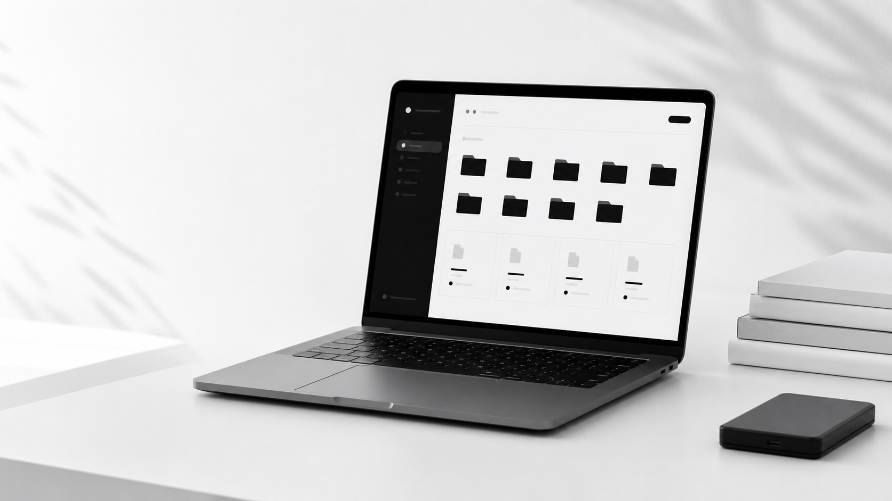
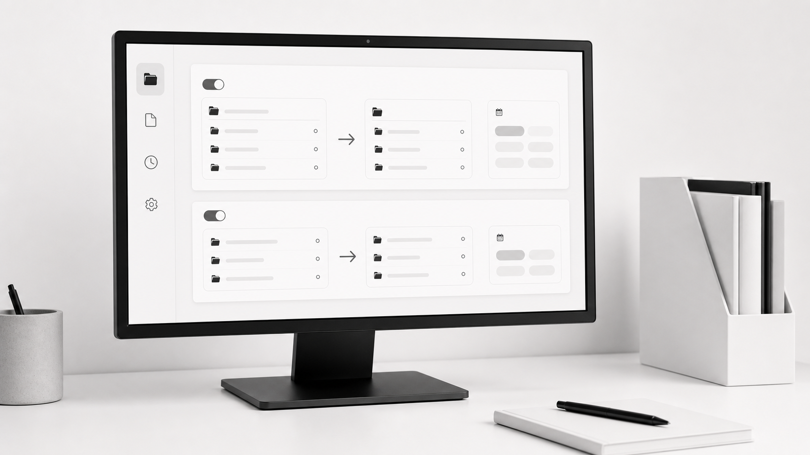
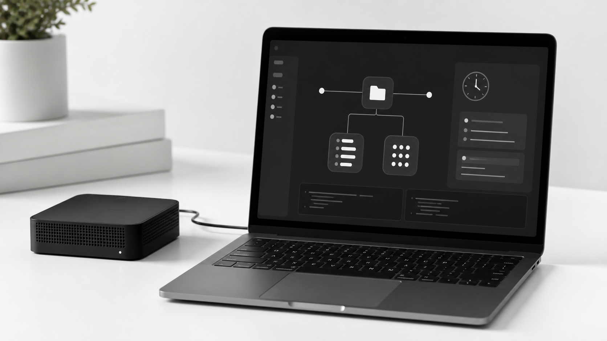

# Shelfy


Minimal local automation for files, folders, backups, and AI workflows.



Shelfy is a privacy-first desktop utility that keeps Downloads, Documents, and project folders organized. It runs locally from the tray, applies simple rules for everyday cleanup, and supports advanced YAML automation for backup and file workflows.

## Highlights

- Local-first file organization for Downloads, Documents, and custom folders
- Visual rules for common backup and sorting flows
- Source YAML mode powered by the built-in Orden engine
- Fixed-time and cron scheduling with background keepalive logs
- Windows Task Scheduler and macOS LaunchAgent keepalive installers
- Local MCP server for AI clients via `shelfy --mcp`
- SQLite-backed history, undo, rules, settings, and scheduler logs

## Visual Rules

Use the visual editor for common workflows: pick source files or folders, choose one or more backup destinations, set extensions, and save the generated YAML.



For advanced cases, switch to Source mode and edit the Orden YAML directly:

```yaml
rules:
  - name: Back up PDFs
    locations:
      - ~/Downloads
      - ~/Documents/Incoming
    subfolders: true
    filters:
      - extension: [pdf]
    actions:
      - copy: ~/Documents/Shelfy Backups/PDF/
      - copy: /Volumes/Archive/PDF/
```

## Local AI / MCP

Shelfy can expose local tools to AI clients that support the Model Context Protocol.



```bash
shelfy --mcp
shelfy --cli mcp
```

Available MCP tools include:

- `shelfy_list_folders`
- `shelfy_list_rules`
- `shelfy_recent_logs`
- `shelfy_orden_simulate`
- `shelfy_scan_folder` when write tools are enabled
- `shelfy_orden_run` when write tools are enabled

Write-capable tools are disabled by default and require the separate MCP write permission in Settings.

## CLI

```bash
shelfy --cli scan <folder>
shelfy --cli rules list
shelfy --cli rules export <path>
shelfy --cli rules import <path> [--replace]
shelfy --cli folders list
shelfy --cli folders add <path> [silent|manual|paused]
shelfy --cli folders mode <id> <silent|manual|paused>
shelfy --cli config path
shelfy --cli config export <path>
shelfy --cli config import <path> [--replace]
shelfy --cli orden check <config>
shelfy --cli orden sim <config> [--tags t1,t2] [--skip-tags t3] [--working-dir <dir>]
shelfy --cli orden run <config> [--tags t1,t2] [--skip-tags t3] [--working-dir <dir>]
```

The `organize` CLI namespace is accepted as an alias for `orden`.

## Architecture

```text
React + TypeScript UI
Tauri bridge
Rust core
  - watcher
  - rules engine
  - Orden YAML engine
  - scheduler and keepalive
  - stdio MCP server
SQLite
```

## Development

Requirements:

- Rust stable
- Node.js 22+
- Platform dependencies for Tauri

```bash
npm install
npm run tauri dev
```

Build:

```bash
npm run tauri build
```

Verify:

```bash
npm run build
cd src-tauri && cargo test
```

## Privacy

Shelfy is designed to run locally. File names, rules, logs, and settings stay on your machine unless you explicitly export them or expose tools through MCP.

## License

AGPL-3.0
